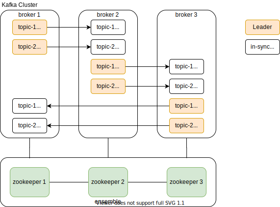
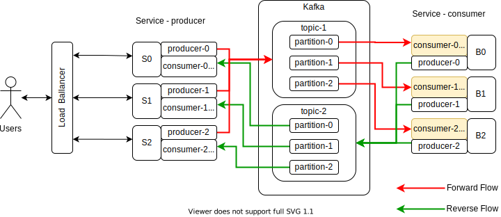

# Kafka 3-node cluster setup





## Start zookeeper cluster
```
bin/zookeeper-server-start.sh config/zookeeper1.properties
bin/zookeeper-server-start.sh config/zookeeper2.properties
bin/zookeeper-server-start.sh config/zookeeper3.properties
```

## Start broker cluster
```
bin/kafka-server-start.sh config/server1.properties
bin/kafka-server-start.sh config/server2.properties
bin/kafka-server-start.sh config/server3.properties
```

## Clean cluster state
```
rm -rf data/zookeeper1/version-2
rm -rf data/zookeeper2/version-2
rm -rf data/zookeeper3/version-2
rm -rf /tmp/kafka-logs-*
```

* __Partitioning:__ Kafka can guarantee ordering only inside the same
  partition and it is therefore important to be able to route correlated
  messages into the same partition. To do so you need to specify a key for
  each message and Kafka will put all messages with the same key in the
  same partition.
* The messages with the same key are guaranteed to be written to the same partition.

* [Blog](https://medium.com/@kiranps11/kafka-and-zookeeper-multinode-cluster-setup-3511aef4a505)
* [Blog](https://blog.newrelic.com/engineering/kafka-best-practices/)